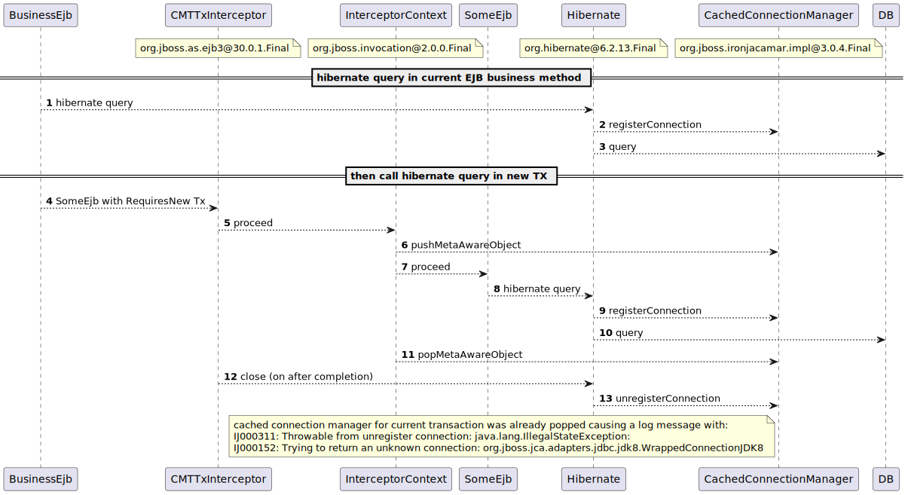

This project reproduces the is `IJ000152: Trying to return an unknown connection` issue that occurs when an ejb method with requires new tx  calls a hibernate 6 query. 

**TLDR**:

Hibernate 6 register a connection for a query and only unregister it on commit.\
But cached Connection Manager is popped on ejb call interceptors that happens before commit.\
As result there is very suspicious INFO log entry containing a stack trace:

```
11:29:51,424 INFO  [org.jboss.jca.core.connectionmanager.listener.TxConnectionListener] (ServerService Thread Pool -- 6) IJ000311: Throwable from unregister connection: java.lang.IllegalStateException: IJ000152: Trying to return an unknown connection: org.jboss.jca.adapters.jdbc.jdk8.WrappedConnectionJDK8@29963cd2
        at org.jboss.ironjacamar.impl@3.0.4.Final//org.jboss.jca.core.connectionmanager.ccm.CachedConnectionManagerImpl.unregisterConnection(CachedConnectionManagerImpl.java:408)
        at org.jboss.ironjacamar.impl@3.0.4.Final//org.jboss.jca.core.connectionmanager.listener.TxConnectionListener.connectionClosed(TxConnectionListener.java:645)
        at org.jboss.ironjacamar.jdbcadapters@3.0.4.Final//org.jboss.jca.adapters.jdbc.BaseWrapperManagedConnection.returnHandle(BaseWrapperManagedConnection.java:629)
        at org.jboss.ironjacamar.jdbcadapters@3.0.4.Final//org.jboss.jca.adapters.jdbc.BaseWrapperManagedConnection.closeHandle(BaseWrapperManagedConnection.java:574)
        at org.jboss.ironjacamar.jdbcadapters@3.0.4.Final//org.jboss.jca.adapters.jdbc.WrappedConnection.returnConnection(WrappedConnection.java:307)
        at org.jboss.ironjacamar.jdbcadapters@3.0.4.Final//org.jboss.jca.adapters.jdbc.WrappedConnection.close(WrappedConnection.java:265)
        at org.hibernate@6.2.13.Final//org.hibernate.engine.jdbc.connections.internal.DatasourceConnectionProviderImpl.closeConnection(DatasourceConnectionProviderImpl.java:127)
        at org.hibernate@6.2.13.Final//org.hibernate.internal.NonContextualJdbcConnectionAccess.releaseConnection(NonContextualJdbcConnectionAccess.java:49)
        at org.hibernate@6.2.13.Final//org.hibernate.resource.jdbc.internal.LogicalConnectionManagedImpl.releaseConnection(LogicalConnectionManagedImpl.java:224)
        at org.hibernate@6.2.13.Final//org.hibernate.resource.jdbc.internal.LogicalConnectionManagedImpl.close(LogicalConnectionManagedImpl.java:258)
        at org.hibernate@6.2.13.Final//org.hibernate.engine.jdbc.internal.JdbcCoordinatorImpl.close(JdbcCoordinatorImpl.java:161)
        at org.hibernate@6.2.13.Final//org.hibernate.internal.AbstractSharedSessionContract.close(AbstractSharedSessionContract.java:396)
        at org.hibernate@6.2.13.Final//org.hibernate.internal.SessionImpl.closeWithoutOpenChecks(SessionImpl.java:412)
        at org.hibernate@6.2.13.Final//org.hibernate.internal.SessionImpl.close(SessionImpl.java:397)
        at org.jboss.as.jpa@30.0.1.Final//org.jboss.as.jpa.transaction.TransactionUtil$SessionSynchronization.safeCloseEntityManager(TransactionUtil.java:160)
        at org.jboss.as.jpa@30.0.1.Final//org.jboss.as.jpa.transaction.TransactionUtil$SessionSynchronization.afterCompletion(TransactionUtil.java:141)
        at org.jboss.as.transactions@30.0.1.Final//org.jboss.as.txn.service.internal.tsr.JCAOrderedLastSynchronizationList.afterCompletion(JCAOrderedLastSynchronizationList.java:127)
        at org.wildfly.transaction.client@3.0.2.Final//org.wildfly.transaction.client.AbstractTransaction.performConsumer(AbstractTransaction.java:223)
        at org.wildfly.transaction.client@3.0.2.Final//org.wildfly.transaction.client.AbstractTransaction$AssociatingSynchronization.afterCompletion(AbstractTransaction.java:306)
        at org.jboss.jts//com.arjuna.ats.internal.jta.resources.arjunacore.SynchronizationImple.afterCompletion(SynchronizationImple.java:72)
        at org.jboss.jts//com.arjuna.ats.arjuna.coordinator.TwoPhaseCoordinator.afterCompletion(TwoPhaseCoordinator.java:539)
        at org.jboss.jts//com.arjuna.ats.arjuna.coordinator.TwoPhaseCoordinator.end(TwoPhaseCoordinator.java:79)
        at org.jboss.jts//com.arjuna.ats.arjuna.AtomicAction.commit(AtomicAction.java:138)
        at org.jboss.jts//com.arjuna.ats.internal.jta.transaction.arjunacore.TransactionImple.commitAndDisassociate(TransactionImple.java:1271)
        at org.jboss.jts//com.arjuna.ats.internal.jta.transaction.arjunacore.BaseTransaction.commit(BaseTransaction.java:104)
        at org.jboss.jts.integration@7.0.0.Final//com.arjuna.ats.jbossatx.BaseTransactionManagerDelegate.commit(BaseTransactionManagerDelegate.java:80)
        at org.wildfly.transaction.client@3.0.2.Final//org.wildfly.transaction.client.LocalTransaction.commitAndDissociate(LocalTransaction.java:78)
        at org.wildfly.transaction.client@3.0.2.Final//org.wildfly.transaction.client.ContextTransactionManager.commit(ContextTransactionManager.java:71)
        at org.jboss.as.ejb3@30.0.1.Final//org.jboss.as.ejb3.tx.CMTTxInterceptor.endTransaction(CMTTxInterceptor.java:74)
        at org.jboss.as.ejb3@30.0.1.Final//org.jboss.as.ejb3.tx.CMTTxInterceptor.invokeInOurTx(CMTTxInterceptor.java:267)
        at org.jboss.as.ejb3@30.0.1.Final//org.jboss.as.ejb3.tx.CMTTxInterceptor.requiresNew(CMTTxInterceptor.java:391)
        at org.jboss.as.ejb3@30.0.1.Final//org.jboss.as.ejb3.tx.CMTTxInterceptor.processInvocation(CMTTxInterceptor.java:145)
        ...
```

with hibernate 5  this problem does not occur as connections are registered and unregistered immediately.

-----

this project only contains 2 classes,  [one to trigger the ejb method at startup](src/main/java/com/ossnms/issue/requires_new/and/hibernate6/StartupTrigger.java) and [another to reproduce the issue](src/main/java/com/ossnms/issue/requires_new/and/hibernate6/SomeEJB.java)

to reproduce de problem, clone the repo and run
```shell
mvn wildfly:dev
```

the minimal version to reproduce the problem is:
```java
@Stateless
public class SomeEJB {

    @EJB
    private SomeEJB selfRef;

    @PersistenceContext
    private EntityManager em;

    private void dbCall() {
        em.createNativeQuery("SELECT 1 FROM DUAL", Long.class).getSingleResult();
    }

    @TransactionAttribute(TransactionAttributeType.REQUIRES_NEW)
    public void dbCallInNewTx() {
        dbCall();
    }

    public void someComplexStuff() {
        // call in current ejb context (no not use selfRef)
        dbCall();
        // call in a new TX
        selfRef.dbCallInNewTx();
    }

}
```

Sequence bellow (created from stack traces) allows to visualize the issue:



And the stack traces in some points: 

stack trace on 6
```
at org.jboss.ironjacamar.impl@3.0.4.Final//org.jboss.jca.core.connectionmanager.ccm.CachedConnectionManagerImpl.pushMetaAwareObject(CachedConnectionManagerImpl.java:438)
at org.jboss.as.connector@30.0.1.Final//org.jboss.as.connector.deployers.ra.processors.CachedConnectionManagerSetupProcessor$CachedConnectionManagerSetupAction.setup(CachedConnectionManagerSetupProcessor.java:87)
at org.jboss.as.ejb3@30.0.1.Final//org.jboss.as.ejb3.component.interceptors.AdditionalSetupInterceptor.processInvocation(AdditionalSetupInterceptor.java:37)
at org.jboss.invocation@2.0.0.Final//org.jboss.invocation.InterceptorContext.proceed(InterceptorContext.java:422)
at org.jboss.as.ejb3@30.0.1.Final//org.jboss.as.ejb3.tx.CMTTxInterceptor.invokeInOurTx(CMTTxInterceptor.java:237)
at org.jboss.as.ejb3@30.0.1.Final//org.jboss.as.ejb3.tx.CMTTxInterceptor.requiresNew(CMTTxInterceptor.java:391)
...
```

stack trace on 11
```
at org.jboss.ironjacamar.impl@3.0.4.Final//org.jboss.jca.core.connectionmanager.ccm.CachedConnectionManagerImpl.popMetaAwareObject(CachedConnectionManagerImpl.java:283)
at org.jboss.as.connector@30.0.1.Final//org.jboss.as.connector.deployers.ra.processors.CachedConnectionManagerSetupProcessor$CachedConnectionManagerSetupAction.teardown(CachedConnectionManagerSetupProcessor.java:103)
at org.jboss.as.ejb3@30.0.1.Final//org.jboss.as.ejb3.component.interceptors.AdditionalSetupInterceptor.processInvocation(AdditionalSetupInterceptor.java:50)
at org.jboss.invocation@2.0.0.Final//org.jboss.invocation.InterceptorContext.proceed(InterceptorContext.java:422)
at org.jboss.as.ejb3@30.0.1.Final//org.jboss.as.ejb3.tx.CMTTxInterceptor.invokeInOurTx(CMTTxInterceptor.java:237)
at org.jboss.as.ejb3@30.0.1.Final//org.jboss.as.ejb3.tx.CMTTxInterceptor.requiresNew(CMTTxInterceptor.java:391)
...
```

stack trace on 13
```
at org.jboss.ironjacamar.impl@3.0.4.Final//org.jboss.jca.core.connectionmanager.ccm.CachedConnectionManagerImpl.unregisterConnection(CachedConnectionManagerImpl.java:408)
at org.jboss.ironjacamar.impl@3.0.4.Final//org.jboss.jca.core.connectionmanager.listener.TxConnectionListener.connectionClosed(TxConnectionListener.java:645)
at org.jboss.ironjacamar.jdbcadapters@3.0.4.Final//org.jboss.jca.adapters.jdbc.BaseWrapperManagedConnection.returnHandle(BaseWrapperManagedConnection.java:629)
at org.jboss.ironjacamar.jdbcadapters@3.0.4.Final//org.jboss.jca.adapters.jdbc.BaseWrapperManagedConnection.closeHandle(BaseWrapperManagedConnection.java:574)
at org.jboss.ironjacamar.jdbcadapters@3.0.4.Final//org.jboss.jca.adapters.jdbc.WrappedConnection.returnConnection(WrappedConnection.java:307)
at org.jboss.ironjacamar.jdbcadapters@3.0.4.Final//org.jboss.jca.adapters.jdbc.WrappedConnection.close(WrappedConnection.java:265)
at org.hibernate@6.2.13.Final//org.hibernate.engine.jdbc.connections.internal.DatasourceConnectionProviderImpl.closeConnection(DatasourceConnectionProviderImpl.java:127)
at org.hibernate@6.2.13.Final//org.hibernate.internal.NonContextualJdbcConnectionAccess.releaseConnection(NonContextualJdbcConnectionAccess.java:49)
at org.hibernate@6.2.13.Final//org.hibernate.resource.jdbc.internal.LogicalConnectionManagedImpl.releaseConnection(LogicalConnectionManagedImpl.java:224)
at org.hibernate@6.2.13.Final//org.hibernate.resource.jdbc.internal.LogicalConnectionManagedImpl.close(LogicalConnectionManagedImpl.java:258)
at org.hibernate@6.2.13.Final//org.hibernate.engine.jdbc.internal.JdbcCoordinatorImpl.close(JdbcCoordinatorImpl.java:161)
at org.hibernate@6.2.13.Final//org.hibernate.internal.AbstractSharedSessionContract.close(AbstractSharedSessionContract.java:396)
at org.hibernate@6.2.13.Final//org.hibernate.internal.SessionImpl.closeWithoutOpenChecks(SessionImpl.java:412)
at org.hibernate@6.2.13.Final//org.hibernate.internal.SessionImpl.close(SessionImpl.java:397)
at org.jboss.as.jpa@30.0.1.Final//org.jboss.as.jpa.transaction.TransactionUtil$SessionSynchronization.safeCloseEntityManager(TransactionUtil.java:160)
at org.jboss.as.jpa@30.0.1.Final//org.jboss.as.jpa.transaction.TransactionUtil$SessionSynchronization.afterCompletion(TransactionUtil.java:141)
at org.jboss.as.transactions@30.0.1.Final//org.jboss.as.txn.service.internal.tsr.JCAOrderedLastSynchronizationList.afterCompletion(JCAOrderedLastSynchronizationList.java:127)
at org.wildfly.transaction.client@3.0.2.Final//org.wildfly.transaction.client.AbstractTransaction.performConsumer(AbstractTransaction.java:223)
at org.wildfly.transaction.client@3.0.2.Final//org.wildfly.transaction.client.AbstractTransaction$AssociatingSynchronization.afterCompletion(AbstractTransaction.java:306)
at org.jboss.jts//com.arjuna.ats.internal.jta.resources.arjunacore.SynchronizationImple.afterCompletion(SynchronizationImple.java:72)
at org.jboss.jts//com.arjuna.ats.arjuna.coordinator.TwoPhaseCoordinator.afterCompletion(TwoPhaseCoordinator.java:539)
at org.jboss.jts//com.arjuna.ats.arjuna.coordinator.TwoPhaseCoordinator.end(TwoPhaseCoordinator.java:79)
at org.jboss.jts//com.arjuna.ats.arjuna.AtomicAction.commit(AtomicAction.java:138)
at org.jboss.jts//com.arjuna.ats.internal.jta.transaction.arjunacore.TransactionImple.commitAndDisassociate(TransactionImple.java:1271)
at org.jboss.jts//com.arjuna.ats.internal.jta.transaction.arjunacore.BaseTransaction.commit(BaseTransaction.java:104)
at org.jboss.jts.integration@7.0.0.Final//com.arjuna.ats.jbossatx.BaseTransactionManagerDelegate.commit(BaseTransactionManagerDelegate.java:80)
at org.wildfly.transaction.client@3.0.2.Final//org.wildfly.transaction.client.LocalTransaction.commitAndDissociate(LocalTransaction.java:78)
at org.wildfly.transaction.client@3.0.2.Final//org.wildfly.transaction.client.ContextTransactionManager.commit(ContextTransactionManager.java:71)
at org.jboss.as.ejb3@30.0.1.Final//org.jboss.as.ejb3.tx.CMTTxInterceptor.endTransaction(CMTTxInterceptor.java:74)
at org.jboss.as.ejb3@30.0.1.Final//org.jboss.as.ejb3.tx.CMTTxInterceptor.invokeInOurTx(CMTTxInterceptor.java:267)
at org.jboss.as.ejb3@30.0.1.Final//org.jboss.as.ejb3.tx.CMTTxInterceptor.requiresNew(CMTTxInterceptor.java:391)
...
```